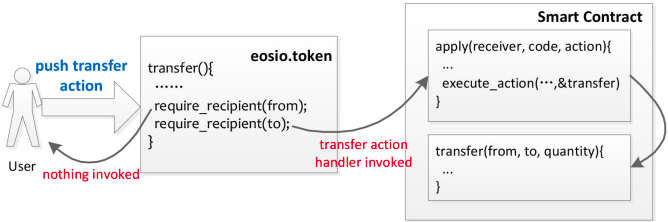

## Name: Forged Token Transfer

### Unique Identifier: EOSIO-WCR-106

### Vulnerability Rating: High

### Relationship: [CWE-352: Cross-Site Request Forgery (CSRF)](https://cwe.mitre.org/data/definitions/352.html)

## Background

The ABI dispatcher/forwarder is the entry point which allows EOSIO smart contracts to listen to incoming token transfer events, like EOS tokens from the _eosio.token_ contract account, as well as normal interactions with the smart contract. A vulnerable smart contract that does not bind _action_ and _code_ to meet security requirements, fails to avoid abnormal and illegal calls.

Token symbols are not globally unique, each smart contract account can create their own token with the same symbol as other token contracts.
A token symbol (consisting of a symbol code and precision) combined with the contract account (commonly referred to as an _extended_ symbol) is unique and both parts must be checked.

### Summary

An implementation of the _(apply)_ function in a **victim** smart contract that does not verify the `code` parameter properly (indicating the token contract account) upon receiving tokens, is **deceived** into **executing** smart-contract logic of **monetary value** on receipt of fake tokens.

#### Diagram



> **Figure 1.** Lifecycle of a token transfer


## Detailed Description

In EOSIO, a token contract can be deployed on any account and the uniqueness of token symbols is not required. This means the _token symbol namespace_ is _independent_ from the _account namespace_ and *not globally unique*. The same token symbol can be created multiple times because token symbols are only unique locally within one contract but not all contracts. Only, the _extended symbol_, that combines a _symbol_ (consisting of symbol code and precision) with its _contract account_ is globally unique. 

There are currently multiple EOS, BTC and EOSDAC tokens on chain. The _eosio.token_ contract does not enforce unique tickers, even for the network token. Each account which runs an eosio.token contract forms a separate namespace. This is to say that [EOS@eosio.token](https://eosauthority.com/account/eosio.token?network=eos) is different from [EOS@eosioleoteam](https://eosauthority.com/account/eosioleoteam) and [EOS@indianastate](https://eosauthority.com/account/indianastate?network=eos) as shown below:

## Vulnerability

EOS Smart contracts that use generic notification handlers (using the * wildcard to handle transfer notifications from any contract) often forget to check the received token symbol’s contract account to prevent against this token forgery attack. 

### Sample Code 

```c++
static constexpr symbol EOS_SYMBOL = symbol("EOS", 4);

// wildcard * used in on_notify, allows the 'transfer' action from any contract!
[[eosio::on_notify("*::transfer")]] 

void on_transfer(name from, name to, asset quantity, string memo) 
{
	// not sufficient to just check token symbol!
	check(quantity.symbol == EOS_SYMBOL, "wrong symbol");
} 
```

### Test Case

> [Test for Forged Token Transfer by Klevoya™](../test_cases/wcr-106/)


## Remediation

### Risk Mitigation

The token contract of the received token needs to be checked with the `code` parameter inside the `apply` code entry point, or compared to the **get_first_receiver** (same as the `code` parameter) function call when using a notification handler macro.


```c++
extern "C" {
   void apply( uint64_t receiver, uint64_t code, uint64_t action ) {
     if(code == name("eosio.token") && action == name("transfer")) {
       // handle transfer
     }
   }
}

// when using a wildcard notification handler
[[eosio::on_notify("*::transfer")]] void on_transfer(
      name from, name to, eosio::asset quantity, std::string memo) {
		// check code paramter (get_first_receiver) for correct token contract
    check(get_first_receiver() == name("eosio.token"), "fake EOS not accepted");
    check(quantity.symbol == EOS_SYMBOL, "EOS only!");
		// ...
}

// when using a contract specific notification handler, this check is implicitly done in the apply function
[[eosio::on_notify("eosio.token::transfer")]] void on_transfer(
      name from, name to, eosio::asset quantity, std::string memo) {
		// code parameter already checked
    check(quantity.symbol == EOS_SYMBOL, "EOS only!");
		// ...
}
```

## Attack 

### Replication 

The attacker duplicates the open source eosio.token contract and issues a token using the same name as the original EOS, whose balance table is maintained in the **forged** _eosio.token_. By transferring in his newly created fake EOS tokens to the DApp, the attacker can then directly invoke the transfer function of the DApp. In vulnerable smart contracts, with no other security checks in place, the condition **code == receiver** will be satisfied. 

This is because the vulnerable DApp’s (apply) function, **doesn't verify** the issuer of the forged EOS tokens sent in to be _eosio.token_ (the official eos token issued by Block.One holding monetary value), instead of some _doppelganger_ account. Instead, it directly _allows code entry_ into the smart contract’s _transfer_ call. 

The result is that the attacker’s forged EOS tokens are deemed sufficient, to continue triggering the remaining code logic of the requested action. This means the attacker has, in essence, tricked the DApp’s (apply) function by sending in **worthless** tokens, in exchange for some presumably **valuable** action.


## References

- [Security Analysis of EOSIO Smart Contracts by EOSAFE](https://arxiv.org/abs/2003.06568)
- [Detecting Fake Transfer Vulnerabilities for EOSIO’s Smart Contracts at Webassembly-level by EVulHunter](https://arxiv.org/pdf/1906.10362)