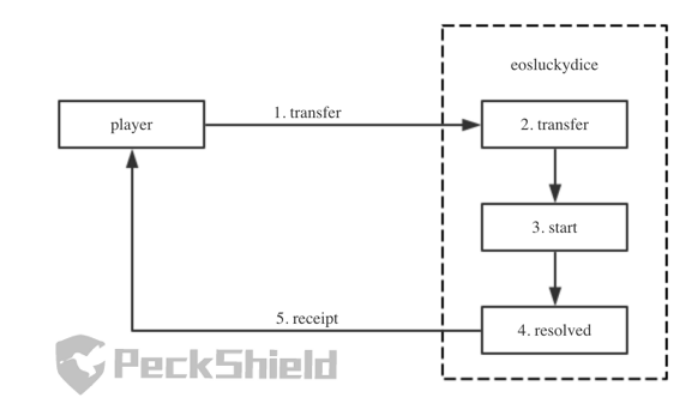

<br/>

## Name: Bad Randomness

### Unique Identifier: EOSIO-WCR-112

### Vulnerability Rating: High

### Relationship: [CWE-338: Use of Cryptographically Weak Pseudo-Random Number Generator (PRNG)](https://cwe.mitre.org/data/definitions/338.html)

## Background
Some smart contracts need access to a random number. Some ways of getting a “random” number are
using a secret value, using embedded secret code, basing the number off of statistics from mining or
using an external oracle. 

Since smart contract code is public on the blockchain, the first two options do
not work. Moreover, EOS does not use _proof-work_, so random statistics from mining, cannot be utilized like in Ethereum.  Moreover, decentralized oracles like Chainlink's [Verifiable Random Function (VRF)](https://docs.chain.link/docs/chainlink-vrf) does not yet have EOS integrations.

### Sample Code 

Open sourced random number generator implementation used by _gambling_ DApps such as _Dappub_ and _EOSBetCasino_

```c++
string sha256_to_hex(const checksum256& sha256) {
  return to_hex((char*)sha256.hash, sizeof(sha256.hash));
}

string sha1_to_hex(const checksum160& sha1) {
  return to_hex((char*)sha1.hash, sizeof(sha1.hash));
}

template <class T>
Inline void hash_combine(std::size_t& seed, const T& v) {
  std::hash<T> hasher;
  seed ^= hasher(v) + 0x9e3779b9 + (seed << 6) + (seed >> 2);
}

uint8_t compute_random_roll(const checksum256& seed1, const checksum160& seed2) {
      size_t hash = 0;
      hash_combine(hash, sha256_to_hex(seed1));
      hash_combine(hash, sha1_to_hex(seed2));
      return hash % 100 + 1;
  }
```

### Summary
EOS Smart contracts with that **generate weak** random numbers on chain allowing the **gamification** of an honest system by an adversary who **coordinates guesses** in a way that **increases** the **likelihood** of **predicting** the **desired outcome**

<br/>

## Detailed Description

In a arbitrary gambling game, a player picks a number to guess and the system provides a reward rate according to the number picked. To do this, the system generates a random number and if the random number is within range of the player guess, the player wins their bet amount multiplied by the reward rate

In the aforementioned game, the gaming smart contract receives the player’s transaction request, delays for let's a set time, say 1.5 seconds, and then calls a **resolve** action. The **resolve** action generates a random number and determines if the player wins, then uses an internal call to notify the player (with a **receipt** action), going on to increment the **bet_id** counter by one and saving it to state for later usage. 

### Diagram


> **Figure 3:** shows the basic game dynamics

<br/>

## Vulnerability

An attacker exploits native EOSIO design choices such as **transaction status rollback** and **pseudo random number generation** by controlling **bet_id**, through the simultaneous usage of several EOS contract accounts, to ensure that the **rearmost** account gets an **expected bet_id** when multiple transaction requests are sent, and wining a larger than usual prize. 

In the publicly known exploit of the _EOS.WIN_ game, the attacker used 5 accounts to bet in small amounts and improve the winning rates, before using the **rearmost** account to bet a large amount and win the master prize. 

### Vulnerable Parameters

Weak entropy sources for random number generation in exploited **get_random()** function:
 * **Transaction Hash ID** (txid)
 * **Block Height** (tapos_block_num)
 * **Block Prefix** (tapos_block_prefix)
 * **Bet Identifier** (bet_id)

> #### Vulnerable Parameter Definitions

* **Transaction status rollback:** In EOS transactions, if one action fails or raises exception, the transaction status will be rolled back. 
For example, if an account deployed smart contract is programmed to raises an exception every time it receives a transfer receipt, then it could cause the transaction to fail, and all information including account balances would stay the same

* **Transaction Hash ID:** One transaction can include several actions. If all action parameters are known, then by adding the aforementioned _tapos_block_prefix_ (ref_block_prefix) information, an attacker can calculate the _Transaction Hash ID_

* **Block Height**: Most on-chain random generators use the _tapos_block_num_ to utilize information in future blocks to generate randomness

* **Block Prefix**: Most on-chain random generators use the _tapos_block_prefix_ to utilize information in future blocks to generate randomness

* **Delayed transaction**: Although a smart contract that uses delayed transactions, by specifying a delay time, uses information in the future, when the transaction starts, the _head_block_ is **known** and _tapos_block_num_ and _tapos_block_prefix_ are **determinable** values

## Attack 

### Top Known

| Attacker Account | Victim Account | Tokens Stolen | Dollars Lost  
| ------ | ------ | ------ | ------
| muma******mm | EOS Play | 20,000 + EOS | $ 50,800.00 +
| Unknown | eosluckydice | 9,180 EOS | $ 23,317.20

### Replication

1. The attacker deploys 6 attack contracts

2. The attacker sends transaction requests at the same time, so that the requests are ‘resolved’ within the **same block**

3. The **tapos_block_num** and **tapos_block_prefix** are consequently the same, leaving only the _bet_id_ to be different

4. The attacker’s first 5 contracts receive the betting result and determine if the current _bet_id_ is a **winning** one or not

5. For each of the first 5 attacker contracts and their corresponding betting requests, if their current _bet_id_ **doesm’t win**, they are programmed to have their **notice** gone on to be **processed** and have the game **increment** the _bet_id_, so that later accounts have a **new bet_id** and **consequently new random number**

6. However, if the current _bet_id_ wins, it is programmed to raise an exception when receiving the result notice, so that the transaction is **rolled back** and the **would be** winning _bet_id_ is **preserved**, allowing the last account, in this case, the 6th attacker account, to come in with a bigger bet and also be likely to win!

## Remediation

### Risk Reduction

Avoid using variables which could be controlled by players such as _bet_id_ for random number generation and avoid putting the **resolve** action and the **notify** action (receipt) in the same transaction

### Risk Mitigation

Utilize external oracle services like [Provable](https://provable.xyz/) to provide external entropy and work with a _provable_ random data source for random number generation. 

| Warning! :warning: Using **Provable** may be expensive or considered by cybersecurity purists as a single point of failure! |
| --- |

```c++
#define PROVABLE_NETWORK_NAME "eosio_testnet_jungle"
#define CONTRACT_NAME "randomsample"

#include "provable/eos_api.hpp"

class randomsample : public eosio::contract
{
  public:
    using contract::contract;

    randomsample(eosio::name receiver, eosio::name code, datastream<const char*> ds) : contract(receiver, code, ds) {}

    [[eosio::action]]
    void getrandnum()
    {
        print("Sending query to Provable...");
        uint8_t N = 1; // Possible outputs: [0-255]
        uint32_t delay = 0;
        provable_newRandomDSQuery(delay, N);
    }

    [[eosio::action]]
    void callback(
        const eosio::checksum256 queryId,
        const std::vector<unsigned char> result,
        const std::vector<unsigned char> proof
    )
    {
        require_auth(provable_cbAddress());
        if (provable_randomDS_proofVerify(queryId, result, proof, _self) != 0)
        {
            // The proof verification has failed, manage this use case...
            print("Number: ", result[0]);
            print(" Proof failed has failed...");
        }
        else
        {
            print("Number: ", result[0]);
        }
    }
};
```
> **Figure5:** The **randomsample.cpp** above allows you to retrieve a random number


#### Methodology

**1)** Compile your contract (launch this command **inside** the folder `random-datasource`):

**`❍ eosio-cpp -abigen randomsample.cpp -o randomsample.wasm`**

**2)** Unlock your wallet:

**`❍ cleos wallet unlock -n <your-wallet-name> --password <your-wallet-password>`**

**3)** Deploy your contract on EOS (launch this command **outside** the folder `random-datasource`):

**`❍ cleos set contract <your-account-name> random-datasource randomsample.wasm randomsample.abi -p <your-account-name>@<permission>`**

**4)** Call the `getrandnum` action of the contract `randomsample`:

**`❍ cleos push action <your-account-name> getrandnum '[]' -p <your-account-name>@<permission>`**

##### :pen: Notes

Provable replies to your `provable_newRandomDSQuery` by calling your `callback(...)` with the *random number result*.
You can search your transaction ID in one of the following links to verify it:

* :mag_right::ledger: [Jungle 3 Blocks.io](https://jungle3.bloks.io/): A block explorer for the Jungle 3.0 testnet.

* :mag_right::ledger: [Kylin Blocks.io](https://kylin.bloks.io/): A block explorer for the Kylin testnet.

<br/>

## References

- [Provable Things](https://github.com/provable-things)
- [Defeating EOS Gambling Games: The Tech Behind Random Number Loophole](https://medium.com/@peckshield/defeating-eos-gambling-games-the-tech-behind-random-number-loophole-cf701c616dc0)
- [Certified Blockchain Security Professional (CBSP)](https://blockchaintrainingalliance.com/products/blockchain-security-training-on-demand)
- [EOS Smart Contract Development Security Best Practices - authorisation Check](https://github.com/slowmist/eos-smart-contract-security-best-practices/blob/master/README_EN.md#authorisation-check)


