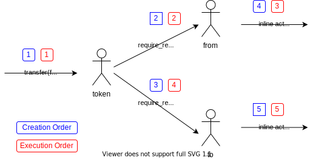

# Re-entrancy Attack

### Unique Identifier: EOSIO-WCR-113

### Vulnerability Rating: Low

### Relationship: [CWE-1265: Unintended Reentrant Invocation of Non-reentrant Code Via Nested Calls](https://cwe.mitre.org/data/definitions/1265.html)

## Background

The execution order of inline actions and notifications in EOSIO is not as intuitive as in other smart contract platforms like Ethereum. When performing an inline action it is not directly executed at the point of the calling instruction. Instead, it is added to a list of actions to be performed and the next action is only executed once the current action is finished. This list is not purely a FIFO queue either, instead, each action creates its own context with its own queue which is then processed. This can lead to complicated execution orders and also means that the execution order (when the action is executed) does not equal the creation order (when the action was scheduled in the code).
In the example of sending a token transfer both the sender and receiver are notified and the two notification actions are first created. If the notified accounts send an inline action on their own again the execution and creation order will be as depicted in the following illustration:



This model of performing inline actions helps to reduce the risk of a common attack on other smart contract platforms called re-entrancy, but does not make it impossible.

## Description 

A re-entrancy attack on EOSIO happens when necessary state updates are postponed to be performed in a different action and an attacker has the possibility to send inline actions in between the original and the state update action.

For example, a `withdraw` action that does not reduce the user's internal balance within the action, but postpones updating the balance until it received the transfer notification of the token contract is vulnerable to an attacker repeatedly withdrawing funds before the balance is updated.

### Sample Code

The vulnerable code updates the user's balance in the token notification handler but notifies the user using a log action before the transfer action is executed.

This allows an attacker to respond to the log notification and re-enter the `withdraw` action before any transfer action and thus balance is updated.

```cpp
ACTION withdraw(name from, asset quantity) {
  require_auth(from);
  check(quantity.amount > 0, "only positive amount");
  // balance check only done here
  auto bitr = balances_table.require_find(from.value, "no balance");
  check(bitr->balance >= quantity, "overdrawn balance");

  // log action does a notify which allows re-entrancy
  log_action log_act(get_self(),
                            permission_level{get_self(), name("active")});
  log_act.send(from, quantity);

  // transfer executed after log action and all of its created inline actions
  // are executed
  token::transfer_action transfer_act(
      EOS_SYMBOL.get_contract(),
      permission_level{get_self(), name("active")});
  transfer_act.send(get_self(), from, quantity, "withdraw");
}

ACTION logwithdraw(name from, asset quantity) {
  require_auth(get_self());
  // allows re-entrancy for from
  require_recipient(from);
}

[[eosio::on_notify("eosio.token::transfer")]] void on_transfer(
    name from, name to, eosio::asset quantity, std::string memo) {
  check(from == get_self() || to == get_self(), "not involved");
  check(quantity.symbol == EOS_SYMBOL.get_symbol(), "must be EOS");
  check(quantity.amount > 0, "must be positive");

  if (from == get_self()) {
    // outgoing transfer notification like withdraw
    // reduce user's balance
    add_balance(to, -quantity);
  } else {
    // incoming transfer notification add to user's balance
    add_balance(from, quantity);
  }
}
```

### Test Case

> [Test for Re-entrancy by Klevoya™](../test_cases/wcr-113/)


## Remediation

Perform necessary state updates and logic that the current action depends on in the same action.

## References 

- [Consensys on Reentrancy Attacks](https://consensys.github.io/smart-contract-best-practices/known_attacks/)
