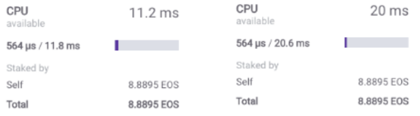
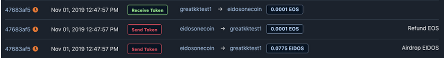
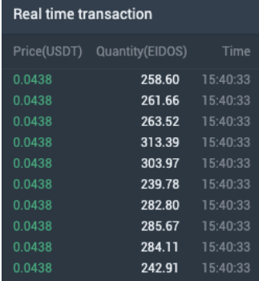
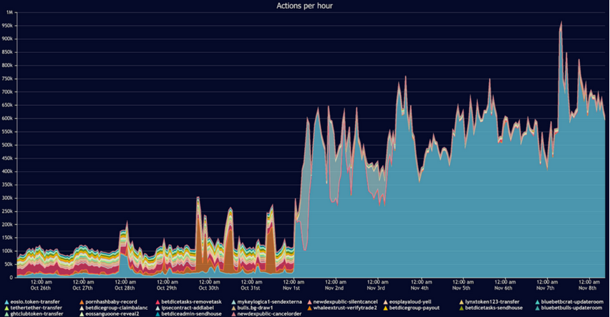

## Name: Denial of Service

### Unique Identifier: EOSIO-WCR-114

### Vulnerability Rating: Medium

### Relationship: [CWE-400: Uncontrolled Resource Consumption](https://cwe.mitre.org/data/definitions/400.html)

## Background

In order to do anything on an EOSIO chain, a user needs to stake a proportional amount of system tokens, either to make computations (CPU), move data (NET) or sell them to store information (RAM).

Within EOSIO, blocks are created 500 milliseconds apart. To help ensure that Block Producers have enough time to propagate blocks around the world, there is a per-block processing time limit of 200 milliseconds (default settings) within which a Producer has to validate the block before broadcasting it to the network. This leaves 300 milliseconds for propagation across the network.


Some EOSIO chains come with a _free CPU leeway_ feature that allows accounts to consume more than their allotted resources if the overall network usage is low. Before this limit is reached, all users can freely transact on the network as it is not in **“congestion mode.”** Once this limit is passed, users are **throttled** back to their **pro-rata share** of the **total CPU-per-staked-EOS allotment**


#### Example

> If there are **10,000 EOS tokens** being staked for **CPU** on **EOS** at a given moment, and Alice's account (an EOS whale) has **930 EOS tokens staked**, then Alice is guaranteed **9.3%** of the **total CPU capacity of the network**. If the network is being heavily used or suffering from a DoS attack, surpassing the **threshold** at which **rate limiting is activated**, Alice would not be able to exceed the guaranteed transaction rate allotted to her by her stake.

Every EOS account has 2 separate values: **used CPU** and **total allowed CPU**. During a period when EOS is not in **congestion mode**, the **total allowed CPU** can fluctuate wildly. The actual CPU leeway multiplier is a chain parameter and it can happen that users are allowed to use 1000 times more CPU than in congestion mode. The image below demonstrates this fluctuation when the chain allows **20.6 ms.** of available compute _(left)_ one moment, to **11.8 ms.** of available compute _(right)_, the very next. 




> **Figure 1:** The CPU Variance means that an EOSIO account may show to have used more than 100% of its allotment

### Summary

Users relying on the EOSIO free CPU leeway feature on an EOSIO chain that is underused will see their available CPU time reduced once the network gets used more and the free CPU time reduces.
Without any free CPU resources their available CPU is restricted to their share of staked system tokens.

## Detailed Description

## Attack 

### Replication 

> This assumes the network is **not** in "_congestion mode_" yet and users receive more resources than their pro-rata share of staked system resources allows.

1. An EOS user sends a minimum of 0.0001 EOS to a Denial of Service Token Drop contract

2. The Denial of Service (DoS) token drop contract will then send a transaction returning the same amount of EOS back to the original sender 

3. The DoS token drop contract also **airdrops** a certain amount of a complimentary custom token as an incentive for the transaction to the original sender’s address




> **Figure 2:** Sample Airdrop Interaction Pattern


4. Since altcoin exchanges list the custom airdrop token with a direct fiat-based stablecoin pair i.e. USDT or USDC, rational actors with at least 0.0001 EOS, are incentivized to collect and attempt to sell the airdropped tokens for a non-zero amount of USDT / USDC




> **Figure 3:** Cleared EOS/USDT Trades (Source: MXC Exchange)

5. To take advantage of this **arbitrage**, rational parties direct leased CPU towards the _airdrop contract_ as there is no penalty for repeated invocation of the airdrop claim, causing an EOS network flood



> **Figure 4:** Number of airdrop _claim_ actions per hour skyrocket on EOS

6. The increased network activity causes the EOS network to enter **congestion mode**, which limits the number of transactions (TXNs) that users can broadcast to their **pro-rata share of total staked CPU**

7. Normal users that were previously able to process their transactions with their _staked CPU_ status quo are now unable to have their transactions processed, due to the same CPU stake now being considered too low an amount by the EOS protocol

| Note: _EOSIO protocol is behaving as expected, but congestion mode prevents users from having transactions processed that exceed their CPU stake_ |
| --- |

1. Such DoS network attacks can be expected to remain in motion as per game theory, until:
    * It is no longer profitable to collect the airdrops 
    * The sizeable _leases_ taken out of the **REX contract** expire (30 days) && the leasers **don’t renew** their _lease_


### Sample Code

A sample **claim** action that encourages users to essentially spam the EOS network in return for a small monetary incentive

```c++
[[eosio::on_notify("eosio.token::transfer")]] void token::claim(name from, name to, eosio::asset quantity, std::string memo)
{
   if (to != get_self() || from == get_self()) 
         return;

   action{
         permission_level{get_self(), "active"_n},
         "eosio.token"_n,
         "transfer"_n,
         std::make_tuple(get_self(), from, quantity, std::string("Refund EOS"))
   }.send();              

   int elapsed = current_time_point().sec_since_epoch();

   if (elapsed > 1572595200) {
      asset supply = eosio::token::get_supply(get_self(), symbol_code("EIDOS"));    
      int64_t expected = (elapsed - 1572595200) * 25;

      asset balance = eosio::token::get_balance(get_self(), get_self(), symbol_code("EIDOS"));

      if (expected > 1000000000)
         expected = 1000000000;

      asset expected_supply = asset(expected, symbol("EIDOS", 4));
      expected_supply *= 10000;

      if (supply < expected_supply){
         asset claim = expected_supply-supply;

         action{
            permission_level{get_self(), "active"_n}, 
            get_self(),
            "issue"_n,
            std::make_tuple(get_self(), claim, std::string("Issue EIDOS"))
         }.send();

         balance += claim;

         claim = claim / 5;

         action{
            permission_level{get_self(), "active"_n},
            get_self(),
            "transfer"_n,
            std::make_tuple(get_self(), "eidosoneteam"_n, claim, std::string("Send to EIDOS Team."))
         }.send();              

         balance -= claim;

      }

      if (balance > asset(0, symbol("EIDOS", 4))) {
         if (balance <= asset(10000, symbol("EIDOS", 4)))
            balance = asset(1, symbol("EIDOS", 4));
         else   
            balance /= 10000;

         action{
            permission_level{get_self(), "active"_n},
            get_self(),
            "transfer"_n,
            std::make_tuple(get_self(), from, balance, std::string("Airdrop EIDOS"))
         }.send();              
      }
   }  
}  
```
> **Figure 5:** The first "transfer"_n refunds EOS while the final  "transfer"_n airdrops EIDOS the sample token

## Remediation

### Risk Reduction

* Victims like large cryptocurrency exchanges can respond to the network issue by increasing the amount of staked CPU in their wallets, to unblock customer transactions

* Users could stake enough resources for their purposes or lend resources from REX.

* Dapps can pay for their users' resources making use of the [`ONLY_BILL_FIRST_AUTHORIZER`](https://github.com/EOSIO/eos/issues/6332) protocol feature.

### Risk Mitigation

* Block Producers could **remove** the **80% cap** on **REX** rentals to allow the price to rent to rise high enough so that more EOS users are incentivized to move their EOS stake to REX

## References

- [Why Does My Account Run Out of CPU on EOS?](https://www.eoscanada.com/en/why-does-my-account-run-out-of-cpu-on-eos)
- [A Mysterious Airdrop Called EIDOS Is Clogging EOS to Make a Point](https://www.coindesk.com/a-mysterious-airdrop-called-eidos-is-clogging-eos-to-make-a-point)
- [EOS enters congestion mode due to EIDOS airdrop](https://blog.coinbase.com/eos-enters-congestion-mode-due-to-eidos-airdrop-3d3f82081074)


