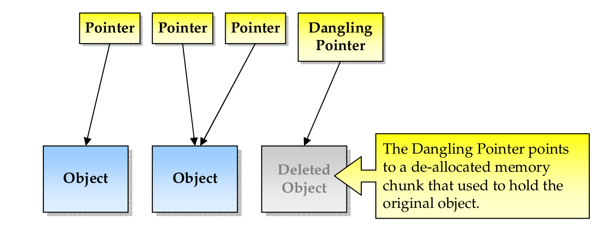

<br/>

## Name: Dangling Pointer

### Unique Identifier: EOSIO-WCR-115

### Vulnerability Rating: Low

### Relationship: [CWE-825: Expired Pointer Dereference](https://cwe.mitre.org/data/definitions/825.html)

## Background

An EOS smart contract in C++ requires **careful** allocation and **deallocation** of memory for instances that are created dynamically during runtime.

Dangling pointers refer to memory locations that were previously held by some objects and which are now deallocated in the EOS smart contract. This part of the memory may be _reallocated to some other object_, which can cause the original pointer or reference to point to _malicious reallocated data_.

This can cause unpredictability in the behaviour of the smart contract The presence of dangling pointers inside EOS smart contract code can at the _very least_ cause **undesirable behaviour**, in more serious cases, lead to a **corruption of data** and in the most severe cases, be exploited for malicious purposes

### Summary

Malicious code pointed to memory locations of dangling pointers, resulting in the introduction of malicious data into EOS smart contract logic during further use,  causing undesirable system behaviour down the line

## Detailed Description

In many EOS smart contracts, memory is allocated for holding data objects. After using these objects, EOSIO may eventually de-allocate their memory, in order to save system resources. In some cases, the
smart contract may use a pointer to an object, whose memory was already de-allocated. If that happens, the smart contract will enter an unintended execution flow which could lead to a crash or more dangerous behaviour

Two typical scenarios result in Dangling Pointers:

* The smart contract makes use of a C++ object after it has been released and thereby accesses an invalid memory location

* A smart contract function returns a pointer to one of its local variables and since this local variable is defined only for the function, the pointer becomes invalid once the function ends

The following figure illustrates the difference between safe active pointers in an EOS dApp and a **dangling pointer**:




> **Figure 10:** the _dangling pointer_ may be exploited to produce unexpected results since it points to an invalid memory chunk

## Vulnerability

A EOS smart contract in C++ requires **careful** allocation and **deallocation** of memory for instances that are created dynamically during runtime. Dangling pointers refer to memory locations that were previously held by some objects which are now deallocated. This part of the memory may be reallocated to some other object, which can cause the original pointer (or reference) to now point at this reallocated data.

This can cause unpredictability in our application. Usage of dangling pointers inside code can at very least cause undesirable behaviour, in some cases corruption of data, and can even be exploited maliciously. Dangling pointers can be targeted by adding malicious code to the memory locations pointed to by them, so that during their further use in application logic, malicious data is introduced in the system and may cause undesirable behavior. 

### Sample Code 
A sample **claim** action that encourages users to essentially spam the EOS network in return for a small monetary incentive

```c++
#include <stdlib.h> 
#include <stdio.h> 
int main() 
{ 
   int *ptr = (int *)malloc(sizeof(int)); 
  
   free(ptr); // the free call makes ptr a dangling pointer bug
} 
```
> **Figure 10:** Deallocating a memory pointed by ptr causes the dangling pointer vulnerability

## Remediation

The best way to improve EOS security is through education for secure blockchain coding practices, which eliminates a majority of vulnerabilities early in the smart contract development life cycle. One good example is to do the following:

```c++
#include <stdlib.h> 
#include <stdio.h> 
int main() 
{ 
   
   ptr = NULL; // No more a dangling pointer due to NULL Pointer

   printf("The value of ptr is %p", ptr); 
   return 0; 
} 
```
> **Figure 11:** To patch the dangling pointer vulnerability we can simply use NULL

| Note: _A null pointer stores a defined value, but one that is defined by the environment to **not** be a valid address for any member or object_ |
| --- |

### Risk Reduction

* **VFTABLE sanity checks** for compiled web assembly _(.wasm)_ code are infrastructure level mechanisms that can provide a better defense for smart contracts
against heap-based security bugs

### Risk Mitigation

* **Address space layout randomization (ASLR)** is a feature that randomizes the addresses that are loaded into the smart contract's address space. 
The randomness makes a dangling pointer bug harder to exploit for as the unpredictable address usage increases the likelihood of containing random data and thwarting arbitrary code execution

## References

- [Smashing the Pointer for Fun and Profit](https://www.blackhat.com/presentations/bh-usa-07/Afek/Whitepaper/bh-usa-07-afek-WP.pdf)
- [Dangling, Void, Null and Wild Pointers](https://www.geeksforgeeks.org/dangling-void-null-wild-pointers/)
- [EOS Smart Contracts Security Audit — A Comprehensive Guide](https://medium.com/quillhash/eos-smart-contracts-security-audit-a-comprehensive-guide-9fca56c535ba)